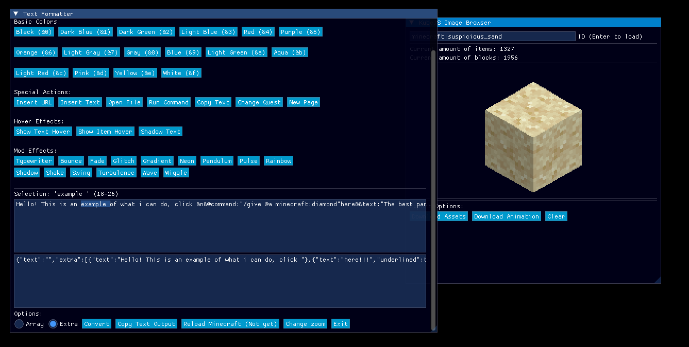
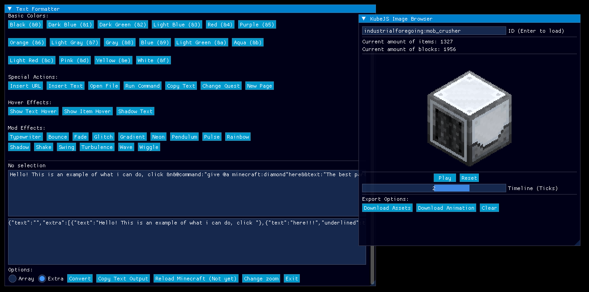

This is a simple version:

- Allows to get text for ftb quests mod more easily, with a lot more effects, using quests methods (aka, using &)
- View items and blocks from the game, download them in a folder (and for blocks, use on Blender) (No parameters yet)

A tool designed to simplify text generation for FTB Quests mod with enhanced effects using quest methods (utilizing `&` symbols).
Well, and now a bit more.

<p align="center">
  
  
</p>

You can check more examples on the example folder!

## Features

- Enhanced text generation for FTB Quests mod
- Support for various text effects using quest methods
- Cross-platform compilation (Windows and Linux) (Linux needs to compile manually)

## Prerequisites

### Required Tools

- **Python3** - For license management and scripts (Although optional, but recommended for seeing licences)
- **CMake** - Build system generator
- **C/C++ Compiler** - Clang recommended
- **Git** - Version control and dependency management
- **Bash-compatible terminal** - For running setup scripts
- **pkg-config** - Needed for configure
- **zip** - Library used to get vcpkg -> It will tells you about that on an error
- Some libraries will require some other dependecies, which would be told on the messages

### Additional Tools (for Windows compilation)

- **LLVM-Mingw** - Cross-compilation toolchain for Windows
- Required LLVM-Mingw tools:
  - `x86_64-w64-mingw32-clang++`
  - `x86_64-w64-mingw32-clang`
  - `x86_64-w64-mingw32-windres`
You can get them from here <https://github.com/mstorsjo/llvm-mingw/releases>

## Installation & Setup

### Method 1: Using Scripts (Recommended)

For Windows, you would need to install VSCode and WSL2

1. **Run the setup script** to install dependencies:

   ```bash
   ./setup.sh
   ```

   For systems without Windows compilation support:

   ```bash
   ./setup.sh --no_win
   ```

2. **Build the project**:

   ```bash
   ./launch.sh
   ```

### Method 2: Manually

Well.... I don't recommend this option when you have the bash scripts

### Method 3: CMake extension on VSCode

It will try to configure and run some commands, but not 100%

## Build Options

### Platform Selection

- `--windows` - Compile for Windows (requires mingw toolchain)
- `--linux` - Compile for Linux (default)

### Build Configuration

- `--debug` - Build with debug symbols
- `--release` - Build optimized release version (default)
- `--no_config` - Skip CMake configuration (faster rebuilds)

### Examples

```bash
# Build for Windows with debug symbols
./launch.sh --windows --debug

# Build for Linux release (skip CMake config)
./launch.sh --linux --release --no_config

# Quick rebuild for current platform
./launch.sh --no_config
```

## Project Structure

```bash
QuestiMakinator/
├── build/                # Build outputs
├── examples/             # Images with examples of the app
├── include/              # Headers of this project
├── src/                  # Source code of this project
├── vcpkg/                # Dependency management
├── vcpkg_installed/      # Installed libraries
├── setup.sh              # Initial setup script
├── launch.sh             # Build and compilation script
└── licenses.py           # License management

```

## Development

### Visual Studio Code Integration

The project includes pre-configured VS Code settings:

- **Debug configurations** for both Linux and Windows
- **Build tasks** for different configurations
- **CMake integration** with proper toolchain setup

### Available VS Code Tasks

- `setup-project` - Run initial setup
- `build-release-linux` - Build Linux release version
- `build-debug-linux` - Build Linux debug version
- `run-licences` - Generate license report
- **While using WSL2**, you can debug for both Windows and Linux

## Dependencies

Managed automatically through vcpkg:

- **imgui-sfml** - Wrapper of DearImGui to use with SFML
- **sfml** - Window and other settings
- **dearimgui** - Mainly GUI component
- **nlohmann-json** - Used for all JSON shenanigans
- **libwebp** - For those nice .webp animated
- **tinyobjloader** - For those special blocks / items
- **backward-cpp** - For that nice stacktrace instead of "std::bad_alloc" alone

## License

All rights reserved on the original code, unless otherwise stated.
Third-party licenses are aggregated in `licenses.csv` generated by `licenses.py` after you setup the project using setup.sh.

What does this mean for you?

- **Personal use** (aka for you or anything that isn't public or don't generate revenue) - You can use it however you like, if you share, a link to this repository or a mention would be nice
- **Commercial use** (aka public visible or generate revenue in any way, directly or indirectly, or 2+ people group/team) - Ask me before

## Troubleshooting

### Common Issues

1. **Missing Compiler Tools**
   - Ensure all required tools are installed and in PATH
   - For Windows cross-compilation, verify LLVM-Mingw installation

2. **Build Failures**
   - Run `./setup.sh` to ensure all dependencies are installed
   - Use `--no_config` flag for faster rebuilds after configuration changes (it will configurate the project if not done before)

3. **License Generation**
   - Run `python3 licenses.py` to regenerate license information

4. **Clangd server complaining**
   - Run the following command

   ```bash
      #On the root folder
      ln -s build/x64-linux/compile_commands.json compile_commands.json
   ```

5. **Program crashing**
   - This is something I don't like  
   Got to a Linux distro / WSL, run the setup script and launch script
   Install libdw `sudo apt install libdw-dev` on Debian/Ubuntu to get
   a report.

### Getting Help

Check the generated executable path displayed after successful compilation.
If issues persist, verify all prerequisite tools are correctly installed and accessible from your terminal.
